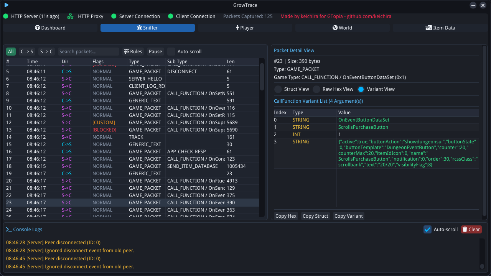
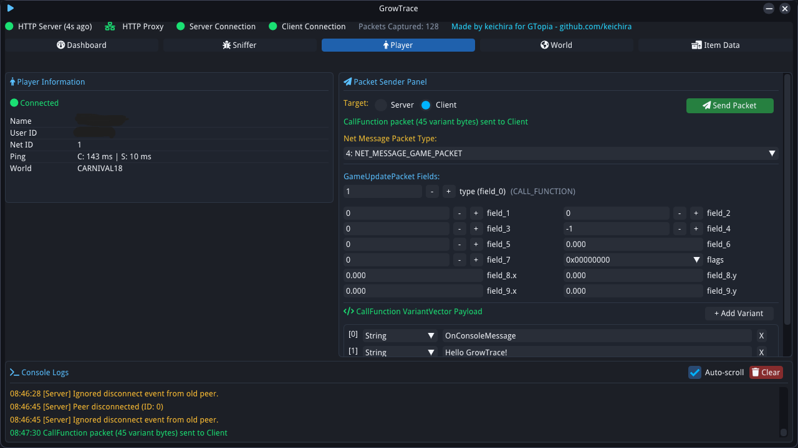
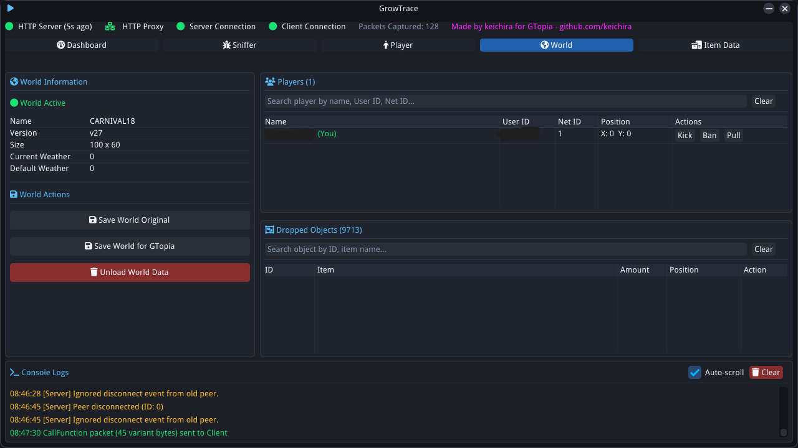
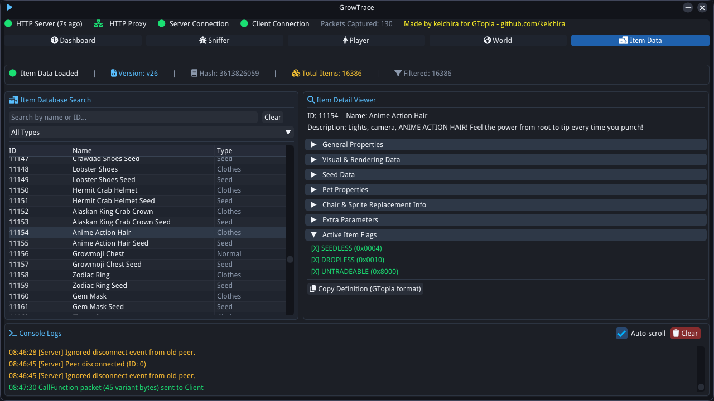

# GrowTrace

[](#)
[](LICENSE)

A cross-platform **Growtopia Proxy** with imgui support.

> 📢 **Join our community!** For development updates, support, and discussions, join our **[Discord Server](https://discord.gg/5XjTQm3kRh)**.

## 📸 Screenshots

| | |
| :---: | :---: |
|  |  |
|  |  |

---
## 🌟 Features

### 📊 1. Real-Time Dashboard & Network Control
- **HTTP Proxy Management**: Toggle and monitor local HTTP/HTTPS proxy binding (Ports 80 / 443) on the fly.
- **Connection Diagnostics**: Live heartbeat and connection indicators for HTTP server, Real Client, and Real Server ENet peers.
- **Traffic Metrics**: Track total captured packets, current memory queue buffers, and log history in real time.
- **Local Server Mode**: Toggle local private server mode with a single click.

### 🐛 2. Packet Sniffer & Hex Inspector
- **Bidirectional Capture**: Sniff both Client-to-Server (`C2S`) and Server-to-Client (`S2C`) network traffic.
- **Granular Filtering**: Filter packets by **Net Message Type** (`NET_MESSAGE_GENERIC_TEXT`, `NET_MESSAGE_GAME_MESSAGE`, `NET_MESSAGE_GAME_PACKET`) and specific **Game Update Packet Types**.
- **Deep Inspection**: View raw packet hex dumps with character mappings.
- **VariantVector Disassembly**: Automatic unpacking and structure display for `NET_GAME_PACKET_CALL_FUNCTION` variant vectors.

### ✈️ 3. Packet Sender
- **Target Selection**: Inject custom raw packets directly into either the Server or the Client stream.
- **Text & Game Message Injector**: Send formatted string packets or game messages instantly.
- **GameUpdatePacket Field Customizer**: Interactively modify packet header flags, integer fields, floats, vectors (`field_8`, `field_9`), and flags via a GUI bitmask picker.
- **Visual VariantVector Builder**: Construct custom `CallFunction` variant payloads visually with support for `String`, `int32`, `uint32`, `float`, `Vector2Float`, and `Vector3Float`.

### 🌍 4. World State & Object Manager
- **Active World Diagnostics**: Display world name, version, tile count, and active weather settings.
- **World Persistence**: Export and save active world states into **GTopia native format** or raw original formats.
- **Player Tracking**: List connected players in the current world with User ID, Net ID, position coordinates $(X, Y)$, and action handles (Kick, Ban, Pull).
- **Dropped Object Browser**: Real-time list of all floating world objects with item search filtering, tile location, and count.

### 📦 5. Item Database Inspector (`items.dat`)
- **Complete Item Search**: Search through thousands of game items by ID or name with category-based drop-down filtering.
- **Detailed Property Inspector**: View details of items.
- **GTopia Export**: One-click **Copy Definition** to export item definitions in GTopia server configuration format directly to the system clipboard.

### 💻 6. Terminal Console Logger
- Integrated multi-colored console log viewer with automatic line scrolling, timestamping.

---

## 🚀 Getting Started
### Clone the Repository
```bash
git clone --recurse-submodule https://github.com/keichira/GrowTrace.git
cd GrowTrace
```
## ⚙️ Setup & Build System

This project uses pre-configured scripts for compilation.  

* All build scripts are located inside the `Build/` directory.

### 🛠️ Compile Scripts

- `compile_win.bat` → Builds project on Windows

---

## 🏃‍♂️ Running
Once compiled, navigate to the `Runtime/` folder.

> ⚠️ Because the HTTP server binds to privileged ports (80/443), you **must** execute the http_server.py with root/administrative privileges

> Run `GrowTrace`

> Run` http_server.py`

---

## 🔗 Connecting Growtopia with GrowTrace

Configure your hosts file

```
127.0.0.1 www.growtopia1.com
127.0.0.1 growtopia1.com

127.0.0.1 www.growtopia2.com
127.0.0.1 growtopia2.com
```

---

## 🔗 Connecting GTopia with GrowTrace

Follow the steps below to connect GTopia with GrowTrace.

### 1. Configure the HTTP Server

In `main.go`, set `SERVER_IP` to your local network (LAN) IP address.

You can find your LAN IP by running the setup script.

Then, start the HTTP server

### 2. Configure GTopia Servers

Edit `servers.txt` and change your GTopia servers running addresses.
Once configured, start the GTopia servers.

### 3. Enable Local Server Mode in GrowTrace

Open GrowTrace and navigate to:

**Dashboard → Quick Actions → Enable Local Server Mode**

### 4. Configure Your Hosts File

Add the following entries to your system's `hosts` file:

```
127.0.0.1 www.growtopia1.com
127.0.0.1 growtopia1.com

YOUR_LAN_IP www.growtopia2.com
YOUR_LAN_IP growtopia2.com
```

Replace `YOUR_LAN_IP` with the LAN IP address of the machine running the GTopia server.

For example:

```
192.168.1.100 www.growtopia2.com
192.168.1.100 growtopia2.com
```

### 5. Connect

Once everything is configured, launch Growtopia and connect normally.
GrowTrace should now be able to communicate with your local GTopia server.

----

## Note
**This project is for educational purposes only. The author is not responsible for any misuse. Use at your own risk.**

---

<a href="https://github.com/keichira/GrowTrace">GrowTrace</a> is made by <a href="https://github.com/keichira">keichira</a>